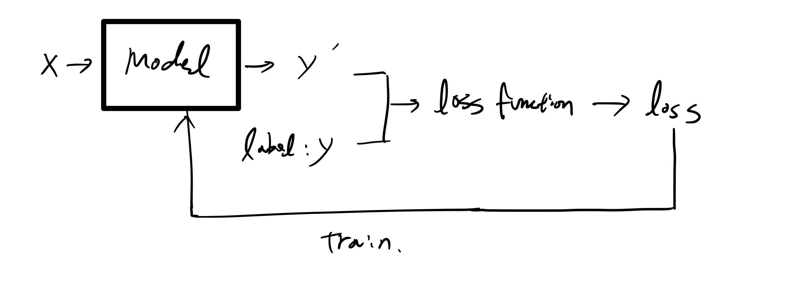
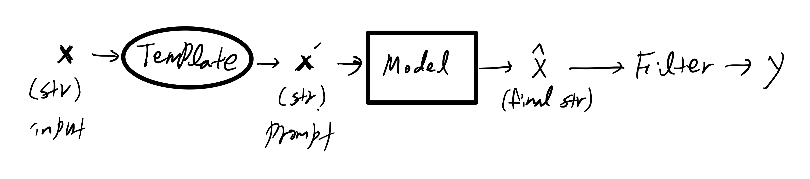
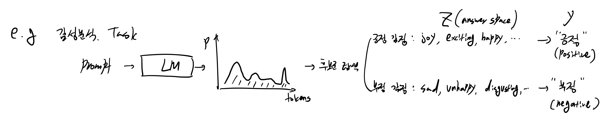

# Note

[ACM Computing Surveys, Vol. 55, No. 9, Article 195. Publication date: January 2023](https://dl.acm.org/doi/full/10.1145/3560815)

논문 제목: Pre-train, Prompt, and Predict: A Systematic Survey of Prompting Methods in Natural Language Processing

을 읽고 정리 및 요약한 내용입니다.

# 목차

1. Sketch(전통적인 지도 학습 vs 프롬프트 기반 모델)
2. Four Paradigms of NLP Progress
    - Architecture Engineering
    - Objective Engineering
    - **Prompt Engineering**
3. Prompting 정의 및 용어 정리
4. 프롬프트 종류
5. 프롬프트 디자인 고려사항
    - 사전학습 모델 선택
    - Prompt Engineering
    - Answer Engineering
    - Expanding the Paradigm
    - 프롬프트를 통한 학습 전략


# 내용

## 1. Sketch(전통적인 지도 학습 vs 프롬프트 기반 모델)

1. Traditional Supervised learning



**기존의 NLP task의 경우 사전학습 된 모델을 feature 추출기로 사용하고 해당 task에 맞게 fine-tuning(미세조정)**

2. Prompt-base model



e. g., 

input: 뉴스 기사

Template: lambda x: f"다음 뉴스 기사 요약해줘. {x}"

x': Template에 input(뉴스기사)를 적용한 자연어

$\hat{x}$: x’ + 요약된 뉴스 기사$

y: 요약된 뉴스 기사

**즉, NLP task를 next token 예측(e. g., GPT) 또는 빈칸 맞추기(e. g., BERT)와 같은 언어모델(LM) task로 재정의**

장점

1) 사전학습된 언어모델(LM)을 feature 추출기로만 쓰는 것이 아니라 직접 task를 해결하기 위한 모델로 적용

## 2. Four Paradigms of NLP Progress

### 1 - Feature Engineering

Paradigm: 완전 지도 학습(인공 신경망 사용 X)

Time Period: 2015년 쯤에 가장 유행

특징:

1) 인공 신경망을 주로 사용하지 않음

2) 개발자가 직접 feature 추출하는 것이 필요

예시:

1) Manual features →Linear or SVM

2) Manual features → Conditional Random Fields(CRF)

### 2 - Architecture Engineering

Paradigm: 지도 학습(인공신경망 이용)

Time Period: 대략 2013 ~ 2018년

특징:

1) 인공 신경망에 의존

2) 개발자가 직접 feature 추출하진 않지만 network 구조를 변경해야 됨(e. g.: LSTM, CNN)

3) 때때로 사전학습된 LM 사용하지만 Embedding과 같은 얕은 feature를 주로 이용

예시:

1) CNN을 이용한 Text 분류

### 3 - Objective Engineering

Paradigm: Pre-train, Fine-Tune

Time Period: 대략 2017년 이후부터 현재까지

특징:

1) 다량의 데이터로 사전학습된 언어모델(LM)을 이용하여 feature 추출

2) model 구조에 대한 연구는 이전에 비해 줄었지만 task에 적합하게 engineering 하는 것은 필요

예시:

1) BERT → Fine Tuning

### 4 - Prompt Engineering

Paradigm: Pre-train, Prompt, Predict

Time Period: 대략 2019년 이후부터 현재까지

특징:

1) NLP task를 언어모델(LM)로 재정의

2) LM을 통해 feature 추출, 그리고 예측 모두 진행

3) Prompt Engineering 필요

예시:

1) GPT3

## Prompt 정의
$f_{prompt}(\cdot)$: input string x를 prompt x'으로 변환해주는 함수

- Template

input string x를 위한 빈칸 \[x]와 정답 빈칸 \[z]를 변수로 취급하여 Prompt를 만들어내는 양식
```
e. g., Template: “[x]의 품사는 무엇입니까?: [z]”
    [x]: 뛰어가다
    [z]: 동사
```

- Prompt 형식
    1. Cloze prompt
        
        정답 빈칸 [z]가 template 사이에 존재하는 경우
        
        e. g., [x]는 매우 [z]한 영화다.
        
    2. Prefix prompt
        
        정답 빈칸 [z]가 template 마지막에 존재하는 경우
        
        e. g., [x]를 영어로 번역하시오. [z]
        
- Answer search
    
    정답 빈칸으로 가능한 후보군에 대한 정의를 뜻합니다.
    
    정답 후보군은 모든 토큰(Vocab)일 수 있고 Task에 따라 일부로 제한될 수 있습니다.
    
    Answer search가 필요한 이유: 기존 NLP task는 얇은 Network를 새로 정의하여 task에 맞게 mapping이 이루어져있는 반면 프롬프트 방식의 경우 사전학습된 언어모델을 그대로 이용하기 때문에 모든 토큰(Vocab)에 대해 확률이 부여되기 때문입니다.
    
    e. g., 후보군 Z = {”excellent”, “good”, “ok”, “bad”, “horrible”}
    
    여기서 후보군 Z 중에서 Label에 mapping 시켜야하는 문제가 존재합니다.
    
    예를 들어 기존 감정 분류 task의 경우 가능한 label이 {”Positive”, “Negative”}만 존재한다고 할 때,
    
    {”excellent”, “good”, “ok”} → “Positive”
    
    {“bad”, “horrible”} → “Negative”
    
    로 전환해주는 작업이 필요합니다
    
    따라서 Prompt를 채우는 함수는 prompt x’과 정답 후보군 Z가 필요합니다
    
    filled prompt: $f_{fill}(x’, Z)$

    filled prompt함수를 통해 후보군 중에서 가장 가능성이 높은 후보($\hat{z}$) 선택
    $$\hat{z}=search_{z \in{Z}} p(f_{fill}(x', z)) $$

    여기서 가능한 $search$의 연산으로는

1) argmax

2) 각각 z의 확률에 따른 sampling

3) etc
    

## Prompting에 대한 고려사항

1. pre-trained LM choice
2. Prompt template engineering
    
    $f_{prompt}(x)$: template 설계 방안
    
3. prompt answer engineering
    
    정답 가능 후보군 $Z$
    
4. Expanding the paradigm
    
    Prompt 엔지니어링 효능을 올리기 위한 paradigm 확장
    
5. prompt-based training strategies
    
    prompt를 이용한 LM(또는 기타 모델) 학습 방안

## Prompt tenmplate engineering

- downstream task에 가장 효율적인 성능을 보이는 prompting 함수 $f_{prompt}(x)$를 만드는 process

### **method**

1) 사람이 직접 prompt template 작성

2) 컴퓨터로 여러 prompt 생성 후 최적 결과 나타내는 프롬프트 선택

먼저 prompt를 생성하기 위해서는 prompt의 형태를 정해야 합니다

### prompt 형태

1) cloze prompt: 빈칸 채우기처럼 정답 빈칸이 template 사이에 존재

2) prefix prompt: 정답 빈칸이 template 마지막에 존재

prompt의 형태는 task와 모델에 영향을 받습니다

일반적으로

1) cloze prompt: 빈칸 채우기 유형 task 그리고 Masked LM(e. g., BERT)에 적합

2) prefix prompt: 생성형 task 또는 auto-regressive LM(e. g., GPT)에 적합

### Prompt 생성

Prompt의 형태가 정해지면 수동으로 Prompt를 생성할지, 자동으로 Prompt를 생성할지 정해야 합니다.

1. Manual template engineering
    
    사람이 보기에 직관적인 prompt를 사람이 생성합니다
    
    단점
    
    1) 좋은 성능을 내는 prompt를 얻기 위해 많은 수작업이 동반됨
    
    2) 숙련된 prompt 디자이너일지라도 최적의 prompt를 얻는데에 실패할 수 있음
    
2. Automated template learning
    
    자동적으로 template을 생성하는 경우 template이 자연어인지 또는 임베딩 차원에 존재하는지에 따라 나뉩니다
    
    1) discrete prompts: 사람이 읽을 수 있는 자연어 prompt
    
    2) continuous prompts: embedding space로 표현되는 prompt(사람이 읽기 난해함)
    
    또한 template을 input string x에 따라 다르게 적용할 것인지에 대해서도 고려를 합니다
    
    1) static: input string x에 상관없이 고정된 prompt template
    
    2) dynamic: input string x에 따라 변하는 prompt template

## Automated template learning

### 1. discrete prompts

1. prompt mining
2. prompt paraphrasing
    
    seed prompt를 재진술(paraphrasing)하여 여러 prompt 생성하는 기법
    
    e. g., 번역, 구절 변경, LLM을 이용한 재진술
    
    → 이렇게 만들어진 여러 prompt들 중 성능이 가장 좋은 prompt 선택
    
3. Gradient Based Search
    
    1) trigger token을 모두 MASK 토큰으로 초기화
    
    2) input + trigger → LM → $p(y|x_{prompt}) = \sum_{w \in{v_{y}}}p([MASK] = w|x_{prompt})$

    3) trigger의 j번째 토큰을 다른 토큰으로 바꾸었을 때의 $p(y|x_{prompt})$ 차이 구하기

→ template을 현재 어떠한 trigger 토큰들로 변경해야 가장 가파르게 P(y|x_{prompt})를 증가시킬 수 있을지

4. prompt generation

    언어모델을 이용하여 prompt 생성

    e. g., input data + [MASK] + label + [MASK] → LM → 빈칸이 채워진 template

5. prompt scoring
    1) 수작업으로 prompt 생성

    2) LM을 이용하여 prompt에 대해 점수 채점

### 2. continuous prompts

    prompt의 경우 사람이 해석하기 위함이 아니라 LM이 task를 잘 수행하도록 도와주는 보조자료이므로 자연어가 아닌 임베딩 영역의 벡터로 존재해도 상관없으며 모델입장에서도 다음 2가지 장점이 존재합니다.

1) template의 임베딩 영역이 자연어로 국한되지 않음

2) 사전학습된 LM의 Parameter로 제한되는 것이 아닌 template 자체의 parameter로 이루어져 downstream taks의 train data에 적합하게 tuning될 수 있음

e. g., [prefix tuning](https://arxiv.org/abs/2101.00190)

특징: 적은 dataset에 대해 discrete prompts보다 초기화 조건에 더 민감

e. g., Tsimpoukelli et al, [Multimodal Few-Shot Learning with Frozen Language Models](https://arxiv.org/abs/2106.13884)

Vision Encoder를 사용하여 prefix 생성한 후, 이를 Captioning task에 활용

학습된 모델의 경우 Few Shot Learning으로 Visual Q&A 활용 가능

**method 2. Tuning initialized with discrete prompts**

discrete prompts 방식으로 prompt의 embedding을 초기화한 후 이 벡터를 네트워크를 이용하여 학습시키는 방법

e. g., AutoPrompt → discrete prompt → Network → continuous prompt

**method 3. Hard-Soft Prompt Hybrid Tuning**

소제목을 통해 알 수 있듯 고정된 Hard prompt와 학습되는 Soft prompt를 섞는 방식입니다.

대표적으로 [P-tuning](https://arxiv.org/abs/2103.10385)이 존재합니다


discrete prompt의 경우 일반적으로 자연어로 쓰인 Template T와 Context x, Target y가 결합하여 임베딩 layer를 거쳐 벡터로 변환됩니다

반면, P-tuning에서는 Context x와 Target y는 자연어로 임베딩되고

Context x와 Target y사이를 continuous prompt가 채우게 됩니다.

## Prompt Answer Engineering

1. answer space Z 찾기
2. Z에서 원래의 output y로 mapping하기



이를 위해

1) answer shape 결정

2) answer design method 결정

### 1. Answer shape

answer shape의 경우

1) token

2) token이 모인 span

3) sentence

가 가능합니다.

task마다 적절한 answer shape이 다릅니다

예를 들어, 개체명 인식(NER)의 경우 token, 언어 생성 task의 경우 sentence가 주로 적합합니다.

### 2. Answer Space design methods

적절한 answer space Z와 이를 최종 output y로 mapping하기 위한 디자인 방법론

1) Manual design

- unconstrained space
    
    answer shape: LM의 모든 tokens
    
    mapping: Identity
    
- constrained space
    
    answer space: 개발자가 정의한 List
    
    e. g., [”health”, “finance”, “politics”]
    
    mapping: 개발자가 정의
    

2) Discrete Answer search

개발자가 정의하는 answer space의 경우 수작업으로 생성된 prompt와 비슷하게 sub-optimal 문제를 해결할 수 있습니다.

- Answer paraphrasing
    
    처음 정의한 answer space Z’을 재진술하여 answer space 확장
    
    e. g., 긍정 감정: “happy” → $f_{para}(\cdot)$ → “good”, “smile” 등
    
    여기서 원래의 answer space(”happy”)를 Z’, 재진술하여 얻어진 answer space를 para(Z’)이라고 정의하면 task는 다음과 같게 됩니다.
    
    $$P(y|x) = \sum_{Z \in{para(Z’)}} P(Z|x)$$
    
    e. g., $f_{para}$: back-translation

- prune-then-search
    1. 후보군 생성
    2. 후보군 중 적합한 것에 대해 answer space 생성
    
    e. g., Gao et al, [Making Pre-trained Language Models Better Few-shot Learners](https://aclanthology.org/2021.acl-long.295/)
    
    1) Template을 통해 [Z]에 가장 높은 확률 top-k 산출(in train data)
    
    2) accuracy 기준으로 top-k 산출된 token들에 대해 가지치기(Zero Shot in train data)
    
    3) 산출된 answer space를 통해 학습
    
    4) dev set에서 accuracy가 가장 높은 label word 선택

    