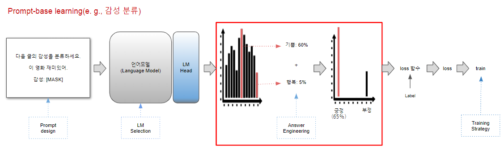
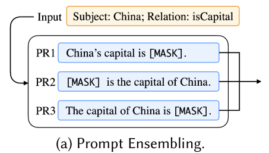

# Note

[ACM Computing Surveys, Vol. 55, No. 9, Article 195. Publication date: January 2023](https://dl.acm.org/doi/full/10.1145/3560815)

논문 제목: Pre-train, Prompt, and Predict: A Systematic Survey of Prompting Methods in Natural Language Processing

을 읽고 정리 및 요약한 내용입니다.

# 목차

1. 서론(전통적인 지도 학습 vs 프롬프트 기반 모델)
2. Four Paradigms of NLP Progress
    - Architecture Engineering
    - Objective Engineering
    - **Prompt Engineering**
3. Prompting 정의 및 용어 정리
4. 프롬프트 종류
5. 프롬프트 디자인 고려사항
    - 사전학습 모델 선택
    - Prompt Engineering
    - Answer Engineering
    - Expanding the Paradigm
    - 프롬프트를 통한 학습 전략


# 내용

## 1. 서론(전통적인 지도 학습 vs 프롬프트 기반 모델)

0. 언어모델(LM)
 - 언어모델: 언어에 확률을 부여하는 것
 - 언어모델 종류
    
    언어모델은 주로 다음 토큰을 예측하는 Auto-Regressive LM, 빈칸을 채우는 Fill Mask LM 두가지를 얘기합니다.
    
    1) 다음 토큰 예측하기 - Auto-Regressive LM(e. g., GPT)
        - input으로 주어진 text에 대해 다음 단어로 어떤 단어가 올지 예측하는 언어모델
        - 이 때, 주어진 text에 대해서 Self Attention이 적용되므로 Context에 대한 정보가 모델에 입력됩니다.
        

    2) 빈칸 맞추기 - Fill Mask LM(e. g., BERT)
        - input으로 주어진 text에서 특정 자연어를 Mask 처리하여 Mask된 단어가 어떤 단어일지 예측하는 언어모델
        - 이 때 Mask된 단어를 제외한 나머지 단어에 대해 Self Attention이 적용되므로 Context에 대한 정보가 모델에 입력됩니다.
        - Mask 처리의 경우 일반적으로 Masked Attention 적용
        

1. Traditional Supervised learning

**기존의 NLP task의 경우 사전학습 된 모델을 feature 추출기로 사용하고 해당 task에 맞게 fine-tuning(미세조정)하는 접근방법을 선택했습니다.**


```python
# pseudo code

out = BERT(x) # out.size(): (batch_size, feature_dim) 

LM_Head = nn.Linear(feature_dim, n_vocab) # LM task에 대해 수많은 Web corpora로 학습된 상태

# 일반적으로, LM Head의 경우 Bert의 출력인 feature를 자연어 단어(vocab) 개수의 차원을 갖는 벡터로 mapping 해주는 Linear Layer

Classification_Head = nn.Linear(feature_dim, n_class) # downstream task를 위해 초기화하여 train data에 학습

# 일반적으로 분류 Head의 경우 Bert의 출력인 feature를 해당 task의 class 개수(n_class)의 차원을  갖는 벡터로 mapping 해주는 Linear Layer
```
일례로 자연어 model hub인 Hugging Face에서 fine-tune을 위해 model을 불러올 때 다음과 같은 warning 메세지를 볼 수 있습니다.
```
Some weights of BertForSequenceClassification were not initialized from the model checkpoint at bert-base-cased and are newly initialized: ['classifier.bias', 'classifier.weight']
You should probably TRAIN this model on a downstream task to be able to use it for predictions and inference.
```
→ 해석하자면 downstream task에 모델을 학습하기 위해 일부 BERT의 Layer가 초기화되었다는 뜻입니다.
- 즉, 다량의 데이터로 학습된 언어모델(LM)을 가져와 기존의 LM Head Layer를 없애고 Task에 적합한 Head Network를 초기화하여 input data X와 label Y를 fitting하는 방법이라고 볼 수 있습니다.

2. Prompt-base model
- 탄생배경
    - GPT-1 등장 이후 Fine-tuning 없이 downstream task를 풀 수 있는 방법은 없을까?에 대한 의문점에서 시작

    cf) Fine-tuning: downstream task data에 대한 별도의 학습(parameter update) 과정
- 근거
    
    매우 많은 Web corpora를 학습함에 따라 언어모델(LM)이 downstream task를 Auto-Regressive 또는 Fill Mask 방식으로 학습을 했습니다.

- 접근 방식

    기존의 Fine-tuning처럼 새로 Network를 정의하는 것이 아닌 Task를 LM Task에 적합하게 setting 해보자!

    e. g., downstream task: 번역

    
- 용어 정리
    - task description
        - 해당 task가 어떤 task인지 기술하는 부분입니다. LM의 경우 Attention을 통해 input으로 주어진 데이터에 대한 Context를 이해하합니다. 따라서 task description으로 LM은 해당 task가 어떤 task인지 알 수 있게 됩니다.
    
    - examples(Optional)
        - 해당 task에 대한 source data와 target data 묶음입니다. 마찬가지로 LM은 input으로 주어진 데이터에 대한 Context를 이해하므로 examples을 통해 해당 task에서 어떤 source data가 들어왔을 때 target data로 어떤 자연어가 들어가야 하는지를 알 수 있게 됩니다.
        - examples이 없을 경우 zero-shot, 하나있을 경우 one-shot, 두개 이상일 경우 few-shot이라 부릅니다.

    - prompt
        - LM task(e. g., 다음 단어 예측, 빈칸 맞추기)에 적합한 Template(틀)에 source data를 입력하여 모델이 target data를 예측하도록 제공하는 자연어(또는 벡터)입니다.

        ```python
        # prompt 예시
        def prompt_function(source_data):
            template = f"{source_data} -> "
            prompt = template
            return prompt

        prompt = prompt_function('cheese')
        ```

**즉, NLP task를 next token 예측(e. g., GPT) 또는 빈칸 맞추기(e. g., BERT)와 같은 언어모델(LM) task로 재정의함으로써 언어모델을 feature 추출기로 사용하는 것이 아닌 언어모델을 통해 task를 풀 수 있는 Network로 사용하게 됩니다.**

- Prompt-based Learning


    
- 목적
    - Prompt의 도움을 받아 사전 학습된 지식 최대한 활용
- 근거
    - Prompt method의 경우 fine-tuning없이 downstream task를 해결하기 위한 모티프로 등장했지만 task를 재정의함에 따라 기존 언어모델(LM)을 학습시켰던 방안처럼 학습 데이터에 fitting 할 수 있게되었습니다.
    
→ 즉 모델의 parameter를 update함으로써 언어모델을 조금 더 학습 데이터에 대해 성능이 잘 나오게 최적화할 수 있습니다.

장점

- 해당 방식(빈칸 채우기, 다음 토큰 예측 등)의 task로 수많은 데이터를 학습했기 때문에 적은 데이터로도 좋은 성능을 가집니다.
- 특정 task, 특정 모델에 따라 추가적인 학습 없이도 downstream task를 해결할 수 있습니다.
- etc

## 2. Four Paradigms of NLP Progress

### 1 - Feature Engineering

Paradigm: 완전 지도 학습(인공 신경망 사용 X)

Time Period: 2015년 쯤에 가장 유행

특징:

1) 인공 신경망을 주로 사용하지 않음

2) 개발자가 직접 feature 추출하는 것이 필요

예시:

1) Manual features →Linear or SVM

2) Manual features → Conditional Random Fields(CRF)

### 2 - Architecture Engineering

Paradigm: 지도 학습(인공신경망 이용)

Time Period: 대략 2013 ~ 2018년

특징:

1) 인공 신경망에 의존

2) 개발자가 직접 feature 추출하진 않지만 network 구조를 변경해야 됨(e. g.: LSTM, CNN)

3) 때때로 사전학습된 LM 사용하지만 Embedding과 같은 얕은 feature를 주로 이용

예시:

1) CNN을 이용한 Text 분류

### 3 - Objective Engineering

Paradigm: Pre-train, Fine-Tune

Time Period: 대략 2017년 이후부터 현재까지

특징:

1) 다량의 데이터로 사전학습된 언어모델(LM)을 이용하여 feature 추출

2) model 구조에 대한 연구는 이전에 비해 줄었지만 task에 적합하게 engineering 하는 것은 필요

예시:

1) BERT → Fine Tuning

### 4 - Prompt Engineering

Paradigm: Pre-train, Prompt, Predict

Time Period: 대략 2019년 이후부터 현재까지

특징:

1) NLP task를 언어모델(LM)로 재정의

2) LM을 통해 feature 추출, 그리고 예측 모두 진행

3) Prompt Engineering 필요

예시:

1) GPT3

## Prompt 정의


$f_{prompt}(\cdot)$: input string x를 prompt x'으로 변환해주는 함수

- Template

input string x를 위한 빈칸 \[x]와 정답 빈칸 \[z]를 변수로 취급하여 Prompt를 만들어내는 양식
```
e. g., Template: “[x]의 품사는 무엇입니까?: [z]”
    [x]: 뛰어가다
    [z]: 동사
```

- Prompt 형식
    1. Cloze prompt
        
        정답 빈칸 [z]가 template 사이에 존재하는 경우
        
        e. g., [x]는 매우 [z]한 영화다.
        
    2. Prefix prompt
        
        정답 빈칸 [z]가 template 마지막에 존재하는 경우
        
        e. g., [x]를 영어로 번역하시오. [z]
        
- Answer search


정답 빈칸으로 가능한 후보군에 대한 정의를 뜻합니다.

정답 후보군은 모든 토큰(Vocab)일 수 있고 Task에 따라 일부로 제한될 수 있습니다.

Answer search가 필요한 이유: 기존 NLP task는 얇은 Network를 새로 정의하여 task에 맞게 mapping이 이루어져있는 반면 프롬프트 방식의 경우 사전학습된 언어모델을 그대로 이용하기 때문에 모든 토큰(Vocab)에 대해 확률이 부여되기 때문입니다.

e. g., 후보군 Z = {”excellent”, “good”, “ok”, “bad”, “horrible”}

여기서 후보군 Z 중에서 Label에 mapping 시켜야하는 문제가 존재합니다.

예를 들어 기존 감정 분류 task의 경우 가능한 label이 {”Positive”, “Negative”}만 존재한다고 할 때,

{”excellent”, “good”, “ok”} → “Positive”

{“bad”, “horrible”} → “Negative”

로 전환해주는 작업이 필요합니다

따라서 Prompt를 채우는 함수는 prompt x’과 정답 후보군 Z가 필요합니다

filled prompt: $f_{fill}(x’, Z)$

filled prompt함수를 통해 후보군 중에서 가장 가능성이 높은 후보($\hat{z}$) 선택
$$\hat{z}=search_{z \in{Z}} P(f_{fill}(x', z)) $$

여기서 가능한 $search$의 연산으로는

1. argmax
2. 각각 z의 확률에 따른 sampling
3. etc
        

## Prompting에 대한 고려사항


1. pre-trained LM choice
2. Prompt template engineering
    
    $f_{prompt}(x)$: template 설계 방안
    
3. prompt answer engineering
    
    정답 가능 후보군 $Z$
    
4. Expanding the paradigm
    
    Prompt 엔지니어링 효능을 올리기 위한 paradigm 확장
    
5. prompt-based training strategies
    
    prompt를 이용한 LM(또는 기타 모델) 학습 방안

## Prompt template engineering


- downstream task에 가장 효율적인 성능을 보이는 prompting 함수 $f_{prompt}(x)$를 만드는 process

### **method**

1) 사람이 직접 prompt template 작성

2) 컴퓨터로 여러 prompt 생성 후 최적 결과 나타내는 프롬프트 선택

먼저 prompt를 생성하기 위해서는 prompt의 형태를 정해야 합니다

### prompt 형태

1) cloze prompt: 빈칸 채우기처럼 정답 빈칸이 template 사이에 존재

2) prefix prompt: 정답 빈칸이 template 마지막에 존재

prompt의 형태는 task와 모델에 영향을 받습니다

일반적으로

1) cloze prompt: 빈칸 채우기 유형 task 그리고 Masked LM(e. g., BERT)에 적합

2) prefix prompt: 생성형 task 또는 auto-regressive LM(e. g., GPT)에 적합

### Prompt 생성

Prompt의 형태가 정해지면 수동으로 Prompt를 생성할지, 자동으로 Prompt를 생성할지 정해야 합니다.

1. Manual template engineering
    
    사람이 보기에 직관적인 prompt를 사람이 생성합니다
    
    단점
    
    1) 좋은 성능을 내는 prompt를 얻기 위해 많은 수작업이 동반됨
    
    2) 숙련된 prompt 디자이너일지라도 최적의 prompt를 얻는데에 실패할 수 있음
    
2. Automated template learning
    
    자동적으로 template을 생성하는 경우 template이 자연어인지 또는 임베딩 차원에 존재하는지에 따라 나뉩니다
    
    1) discrete prompts: 사람이 읽을 수 있는 자연어 prompt
    
    2) continuous prompts: embedding space로 표현되는 prompt(사람이 읽기 난해함)
    
3. Static / Dynamic template

    template을 input string x에 따라 다르게 적용할 것인지에 대해서도 고려를 해야합니다.
    
    1) static: input string x에 상관없이 고정된 prompt template
    
    2) dynamic: input string x에 따라 변하는 prompt template

## Automated template learning

### 1. discrete prompts

1. prompt mining
2. prompt paraphrasing
    
    seed prompt를 재진술(paraphrasing)하여 여러 prompt 생성하는 기법
    
    e. g., 번역, 구절 변경, LLM을 이용한 재진술
    
    → 이렇게 만들어진 여러 prompt들 중 성능이 가장 좋은 prompt 선택
    
3. Gradient Based Search
    
    1) trigger token을 모두 MASK 토큰으로 초기화
    
    2) input + trigger → LM → $p(y|x_{prompt}) = \sum_{w \in{v_{y}}}p([MASK] = w|x_{prompt})$

    3) trigger의 j번째 토큰을 다른 토큰으로 바꾸었을 때의 $p(y|x_{prompt})$ 차이 구하기

→ template을 현재 어떠한 trigger 토큰들로 변경해야 가장 가파르게 P(y|x_{prompt})를 증가시킬 수 있을지

4. prompt generation

    언어모델을 이용하여 prompt 생성

    e. g., input data + [MASK] + label + [MASK] → LM → 빈칸이 채워진 template

5. prompt scoring
    1) 수작업으로 prompt 생성

    2) LM을 이용하여 prompt에 대해 점수 채점

### 2. continuous prompts
prompt의 경우 사람이 해석하기 위함이 아니라 LM이 task를 잘 수행하도록 도와주는 보조자료이므로 자연어가 아닌 임베딩 영역의 벡터로 존재해도 상관없으며 모델입장에서도 다음 2가지 장점이 존재합니다.

1) template의 임베딩 영역이 자연어로 국한되지 않음

2) 사전학습된 LM의 Parameter로 제한되는 것이 아닌 template 자체의 parameter로 이루어져 downstream taks의 train data에 적합하게 tuning될 수 있음

e. g., [prefix tuning](https://arxiv.org/abs/2101.00190)

특징: 적은 dataset에 대해 discrete prompts보다 초기화 조건에 더 민감

e. g., Tsimpoukelli et al, [Multimodal Few-Shot Learning with Frozen Language Models](https://arxiv.org/abs/2106.13884)

Vision Encoder를 사용하여 prefix 생성한 후, 이를 Captioning task에 활용

학습된 모델의 경우 Few Shot Learning으로 Visual Q&A 활용 가능

**method 2. Tuning initialized with discrete prompts**

discrete prompts 방식으로 prompt의 embedding을 초기화한 후 이 벡터를 네트워크를 이용하여 학습시키는 방법

e. g., AutoPrompt → discrete prompt → Network → continuous prompt

**method 3. Hard-Soft Prompt Hybrid Tuning**

소제목을 통해 알 수 있듯 고정된 Hard prompt와 학습되는 Soft prompt를 섞는 방식입니다.

대표적으로 [P-tuning](https://arxiv.org/abs/2103.10385)이 존재합니다


discrete prompt의 경우 일반적으로 자연어로 쓰인 Template T와 Context x, Target y가 결합하여 임베딩 layer를 거쳐 벡터로 변환됩니다

반면, P-tuning에서는 Context x와 Target y는 자연어로 임베딩되고

Context x와 Target y사이를 continuous prompt가 채우게 됩니다.

## Prompt Answer Engineering


1. answer space Z 찾기
2. Z에서 원래의 output y로 mapping하기

이를 위해

1) answer shape 결정

2) answer design method 결정

### 1. Answer shape

answer shape의 경우

1) token

2) token이 모인 span

3) sentence

가 가능합니다.

task마다 적절한 answer shape이 다릅니다

예를 들어, 개체명 인식(NER)의 경우 token, 언어 생성 task의 경우 sentence가 주로 적합합니다.

### 2. Answer Space design methods

적절한 answer space Z와 이를 최종 output y로 mapping하기 위한 디자인 방법론

1) Manual design

- unconstrained space
    
    answer shape: LM의 모든 tokens
    
    mapping: Identity
    
- constrained space
    
    answer space: 개발자가 정의한 List
    
    e. g., [”health”, “finance”, “politics”]
    
    mapping: 개발자가 정의
    

2) Discrete Answer search

개발자가 정의하는 answer space의 경우 수작업으로 생성된 prompt와 비슷하게 sub-optimal 문제를 해결할 수 있습니다.

- Answer paraphrasing
    
    처음 정의한 answer space Z’을 재진술하여 answer space 확장
    
    e. g., 긍정 감정: “happy” → $f_{para}(\cdot)$ → “good”, “smile” 등
    
    여기서 원래의 answer space(”happy”)를 Z’, 재진술하여 얻어진 answer space를 para(Z’)이라고 정의하면 task는 다음과 같게 됩니다.
    
    $$P(y|x) = \sum_{Z \in{para(Z’)}} P(Z|x)$$
    
    e. g., $f_{para}$: back-translation

- prune-then-search
    1. 후보군 생성
    2. 후보군 중 적합한 것에 대해 answer space 생성
    
    e. g., Gao et al, [Making Pre-trained Language Models Better Few-shot Learners](https://aclanthology.org/2021.acl-long.295/)
    
    1) Template을 통해 [Z]에 가장 높은 확률 top-k 산출(in train data)
    
    2) accuracy 기준으로 top-k 산출된 token들에 대해 가지치기(Zero Shot in train data)
    
    3) 산출된 answer space를 통해 학습
    
    4) dev set에서 accuracy가 가장 높은 label word 선택

    

- label decomposition

3) Continuous Answer Search


## Multi Prompt Learning


하나의 Prompt만 LM에 전달하는 것이 아닌 여러 Prompts를 LM에 전달하여 성능을 올리는 기법

### 1. Prompt Ensembling
다수의 Prompt를 LM에 전달하는 기법입니다.



- 장점

    1) 서로 다른 Prompts의 이점을 모두 가질 수 있습니다.
    2) 가장 좋은 Prompt를 고르는 데에 대한 비용이 감소합니다.
    3) Performance 안정화

    각 Prompt에 대해 MASK 토큰 예측 결과가 다르므로 이 중에서 answer를 어떻게 도출할 것인지 정해야합니다.

    - answer를 고르는 방법
    1) 각 prompt 결과 평균
        
        $p(z|x) = \frac{1}{k}\sum_{i}^{k}p(z|f_{prompt, i}(x))$
        $f_{prompt, i}(\cdot):$ i번째 prompt

        
    2) 가중 평균(Weighted Average)
        
        method 1 - Prompt Performance에 따라 가중치 설정하여 평균

        method 2 - 가중치 학습(using train data)

    3) Voting
        Prompt결과 나온 예측 token에 대해 Voting

        $Max\; LM(prompt_{1})$ = "happy"

        $Max\; LM(prompt_{2})$ = "greatful"

        $Max\; LM(prompt_{3})$ = "happy"

        → Voting

        "happy": 2 

        "greatful": 1

    4) Knowledge distillation
        
        step 1) 각기 다른 LM에 (prompt, answer) set을 통해 학습

        step 2) 각기 다른 LM을 앙상블하여 label이 없는 task 예측 <br>
            → 즉, (prompt, predict) 결과 산출

        step 3) 얻어진 많은 양의 (prompt, predict)를 통해 모델 distill

    5) Prompt Ensembling for text generation

        다음 예측 token에 대해 ensemble 적용
        
### 2. Prompt Augmentation(or demonstration learning)
task description 외에 몇 개의 예제 문제와 답안을 LM에 제공하는 기법

few-shot으로 더 많이 알려져있는 방안입니다. 

cf) 저자들은 few-shot보다 Prompt Augmentation이 더욱 적합한 이름이라고 생각합니다,


- 고려사항

    1) 어떤 (예제 문제, 답안) set를 sampling할 것인지? (sample selection)
    
    2) sample 순서 (sample ordering)

1) sample selection
    
    1) embedding 단에서 input과 가장 유사한 sample 탐색

        e. g., 
        
        input: cup
        
        top-k similarity(cup) -> (bottle, container, ...)

    2) positive sample과 negative sample 동시에 제공

        e. g., 감성분석 task의 경우 긍정 감성과 부정 감성 sample 동시에 제공

2) sample ordering
    
    skip

### 3. prompt composition
task가 여러 문제로 이루어진 경우 prompt를 단일 문제로 쪼개어 모델 성능 향상하는 기법


### 4. prompt decomposition
하나의 task를 위해 여러 예측들이 선행되어야할 경우 프롬프트를 쪼개어 LM이 하나씩 해결하게 만드는 기법


## Training Strategies for prompting methods


### Training settings
1. Prompt update 측면      

    1) zero shot setting(Non-Param Update)

    - 많은 경우 사전 학습된 LM의 Parameter update 없이 빈칸 채우기 task로 downstream task를 prompt만으로 해결이 가능합니다.

    2) Param Update 

    - prompt와 train data를 통해 모델을 학습하는 방법입니다

        - 데이터 양 측면

            full data learning: 많은 학습 데이터를 통해 model 학습

            few shot learning: 적은 수의 학습 데이터로 model 학습

            cf) prompt-based learning의 경우 few shot learning에 매우 유용. 
            
            이유: prompt를 통해 모델에게 task description을 주어 task를 해결하는 데에 도움을 줍니다.

2. Parameter Update method

    prompt-based learning에서 parameter는 크게

    1) pre-trained LM
    2) prompt

    두가지가 존재합니다.

    이에 따라, 어떤 parameter를 update할 것인지 선택하는 것은 매우 중요합니다.

    이 결정은 application단에서 어떤 시나리오로 서비스를 유저에게 제공할 것인지에 따라 다를 수 있습니다.

    (예를 들어, 일반적인 챗봇 APP의 경우 prompt를 update하기는 어려울 것입니다. 왜냐하면 개발자가 promopt를 지정하는 것이 아닌 user가 임의의 prompt를 제시하기 때문입니다.)

    방법론
    
    1) pre-trained LM parameter update
    2) prompt와 연관된 parameter 추가
    3) prompt와 연관된 parameter 학습

* Promptless Fine-tuning
    
    prompt없이 언어모델을 학습하는 방법입니다.
    

    * 장점

        1. prompt를 설계 및 만들 필요가 없습니다.
        2. 단순합니다.
        3. 학습데이터에 fit할 수 있습니다
    
    * 단점

        1. overfit의 가능성이 있습니다.
        2. 적은 학습 데이터에 대해 불안정하게 학습합니다.
        3. 사전학습하며 배운 지식을 잃어버릴 수 있습니다(catastrophic forgetting)

* tuning-free prompting

    1. LM parameter를 update하지 않습니다.
    2. prompt를 제시합니다

    * 장점
        
        1. parameter update 프로세스가 존재하지 않습니다
        2. 사전학습하며 배운 지식을 잃어버리지 않습니다
        3. zero-shot setting에서 활용할 수 있습니다.

    * 단점

        1. prompt가 유일한 task에 대한 cue이므로 높은 정확도를 위해서는 많은 engineering이 필요합니다.
        2. in-context learning setting에서 많은 예시문을 주는 것은 inference 속도를 느리게하므로 많은 수의 data를 사용할 수 없습니다.

* Fixed-LM prompt tuning

    1. LM parameter를 update하지 않습니다.
    2. prompt 변수를 update 합니다(supervision signal을 이용하여)
    
    e. g., prefix-tuning, prompt-tuning

    * 장점
        
        1. tuning-free prompting과 비슷한 장점 공유
        2. Few shot 시나리오에 안정적입니다.
        3. 종종 tuning-free보다 성능이 우수합니다.

    * 단점
        
        1. zero-shot 시나리오에 부적합합니다.
        2. large data setting에서 representation power가 제한되어 있습니다.
        3. prompt update를 위한 seed prompt와 hyper parameter를 선택해야 합니다.
        4. 최적화된 prompt가 사람이 이해하기 어렵거나 조작하기 어렵습니다.

* Fixed prompt LM tuning
    
    1. prompt 고정
    2. LM parameter를 update합니다.

        * method 1
            
            가장 직관적인 방식은 discrete prompt(자연어)를 주고 LM을 train data에 대해 학습하는 것입니다.

            e. g., PET-TC, PET-GEN, LM-BFF

        * method 2(null prompt)

            input data와 label을 바로 붙여서 학습합니다(without any template word)

            따라서 [x][z]와 같은 형식으로 LM의 input으로 들어갑니다.

    * 장점
        
        1. template 또는 answer engineering을 통해 task에 대해 상세히 명시할 수 있습니다.

        2. Few shot 시나리오에 적합합니다.

    * 단점
        
        1. template 또는 answer engineering이 여전히 필요합니다.
        2. 다른 학습방식보다 덜 효과적일 수 있습니다.

* prompt + LM tuning
    
    promopt와 LM의 parameter를 모두 update합니다.

    e. g., PADA, p-tuning

    * 장점

        1. The most expressive method
        2. 학습 데이터가 많은 경우에 적합합니다.

    * 단점

        1. 학습이 필요합니다.
        2. 모델의 모든 parameter를 저장해야합니다.
        3. 적은 데이터에 대해 overfit할 가능성이 존재합니다.

## Challenges
1. 사전 학습 언어모델 선택
    
    각기 다른 LM에 대해 prompt-base learning의 차이를 밝힌 연구가 아직 존재하지 않습니다.

2. prompt design

    * 분류, 생성을 제외한 task에 대한 연구

        현재까지 prompt-base learning에서 분류와 생성에서 연구가 활발히 진행되고 있습니다.

        반면 information extraction, text analysis의 경우 논의가 덜 되어있습니다.

        이에 대한 이유는 해당 task의 prompt가 덜 직관적이기 때문입니다.

        저자는 크게 두가지로 접근할 수 있을 것으로 예상하는데

        1) 분류 또는 생성문제로 재정의
        2) 구조화된 출력값에 적합하도록 prompt answer engineering 수행

    * 구조화된 정보에 대한 prompting

        NLP task에서 입력값은 다양한 구조를 가질 수 있습니다(e. g., tree, graph 등)

        이에 따라 구조화된 template 또는 answer enginnering을 어떻게 표현할 것인지가 문제점입니다.